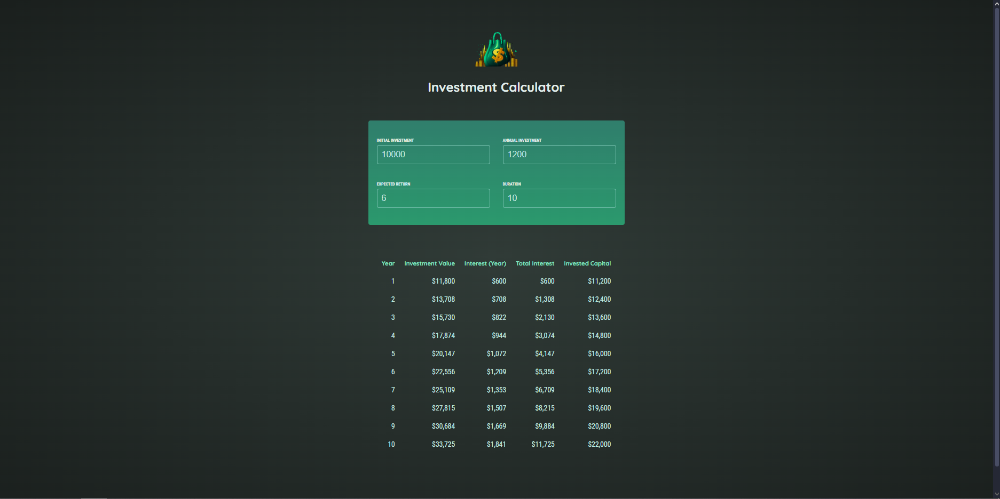
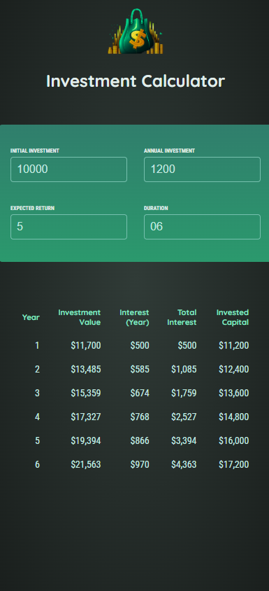

# Investment-calculator
A calculator investment in react using state.

<h1> 

<h2> Mobile view </h2>

</h1>

## 🚨 Sobre

**Investment-calculator** é um projeto que desenvolvi ao participar do curso de React da udemy no qual me aprodundei em conceitos base do react como rooks, componentes etc
   
## 🔧 Ferramentas

- React
- Vite

 
## 🎯 Link do projeto:
### <a target="_blank" href="https://nattancode07.github.io/Investment-calculator/">https://nattancode07.github.io/Investment-calculator/</a>